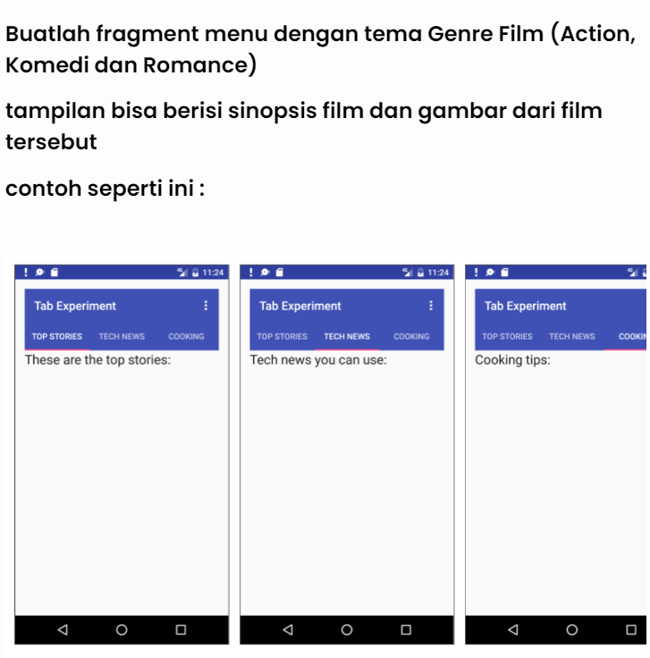

# fragments_movie

|  |  |  |
|-----|------|-----|
|Nama|Muhammad Riyadus Solihin|
|NIM|312210404|
|Kelas|TI.22.A.4|
|Mata Kuliah|Pemograman Mobile|

## Fragment
- Fragment adalah komponen dasar dalam pembangunan antarmuka pengguna (UI) di Android. Fragmen dapat dianggap sebagai bagian modular dari aktivitas yang dapat digunakan kembali dan dipasangkan dengan aktivitas lain. Mereka membantu dalam memecah antarmuka pengguna menjadi potongan-potongan yang lebih kecil dan dapat dikelola secara independen.
- Setiap fragment memiliki siklus hidupnya sendiri, dan mereka dapat ditambahkan atau dihapus selama runtime. Fragmen biasanya digunakan untuk membuat antarmuka yang responsif dan dapat digunakan kembali di berbagai layar atau tata letak.

### ViewPager di Android Studio
- ViewPager adalah widget di Android yang memungkinkan pengguna untuk menelusuri konten secara horisontal, seringkali digunakan dalam konteks tata letak tab atau tata letak swipeable. Ini sangat berguna ketika Anda memiliki beberapa tampilan (misalnya, fragmen) yang ingin ditampilkan satu per satu dengan menggeser.

### ViewPager dengan Fragment
- Ketika Anda menggabungkan ViewPager dengan Fragmen, Anda dapat membuat antarmuka yang memungkinkan pengguna untuk menelusuri antara berbagai fragmen dengan cara yang halus. Setiap fragmen dalam ViewPager dapat mewakili tampilan atau bagian dari tampilan yang berbeda. 

## TUGAS

## Hasil Tampilan

<video width="320" height="240" controls>
  <source src="gambar/hasil.mp4" type="video/mp4">
</video>
